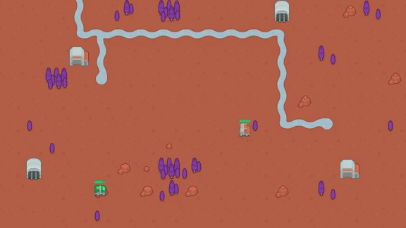
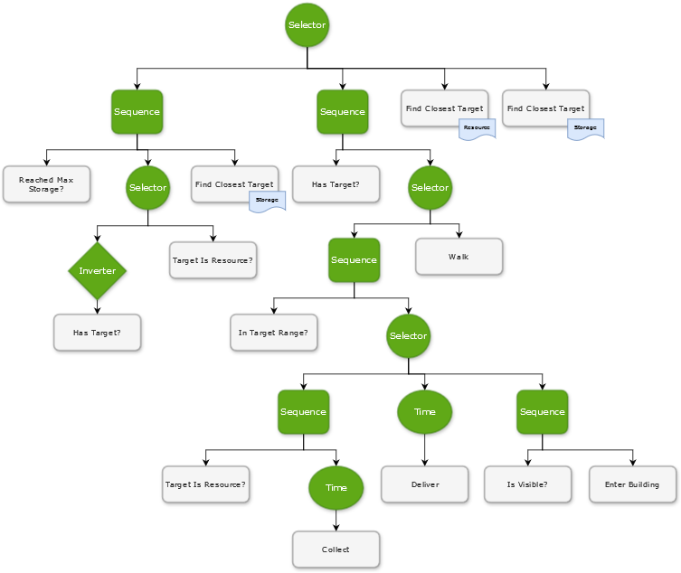

# behaviour tree toolbox

This repository contains a collection of tools for working with behaviour trees using godot and C#, based on Mina Pêcheux's AI ebook that can be found here:

<https://minapecheux.com/projects/ebook-unity-ai>

The book takes a look at various AI models and includes example projects that demonstrate some specific concepts, like using a Behaviour Tree. I was researching the topic for a project and used this design in a game, but also ported the book's _toolkit_ to godot (as a proof of concept for myself more than anything).

## the toolbox

Take a look in the [BehaviourTree](./BehaviourTree) folder as this contains the basic [Node](./BehaviourTree/Node/) definition, state and data for use with specialised (derived) classes. The folder also has `Composite` and `Decorator` `Node`s.

* `Selector` - this acts like an 'OR', succeeding if any child node has a `Success` state.
* `Sequence` - evaluating child nodes only succeeding when child nodes all child nodes have a `Success` state; an 'AND'.
* `Inverter` - flips the results of a child node; e.g. 'NOT'.
* `Timer` - run a child node periodically.

`Node`s form the [BTree](./BehaviourTree/BTree/BTree.cs) that hooks into godot's physics process callback (via `Node2D`) to evaluate the tree.

## example

The [Game](./Game) folder contains a working example from the book that builds on the behaviour tree toolbox. It's a little RTS-like system that has a couple of AI [Collectors](./Game/CollectorAI/Collector.cs) roam around and find resources, collect them and return to base.

Each collector has an instance of the behaviour tree and each node in the tree derives from the toolbox and implements game-specific code to evaluate state, such as searching for a resource type or navigating the world. The tree is evaluated left-to-right, depth-first.

## godot features

The example uses:

* tilemap with custom data _(although I found this buggy using per tile data?)_
* navigation agents
* sprites
* event bus

Albeit not specific to behaviour trees, the example shows how using godot's features, when broken down into discrete pieces of logic, simplifies some of the complexity associated with AI.

Do note that I don't claim this is the correct or best way to implement a game and bugs do exist (for example, finding the nearest target results in an 'as the crow flies' result; the AI should be checking the length of a navigation path result). These are issues with the behaviour tree itself but implementation details present in all games.

The game also has some tests although no means extensive. The project uses [GoDotTest](https://github.com/chickensoft-games/GoDotTest).

## more stuff

Free AI content here: <https://www.gameaipro.com/>

Assets from kenney: <https://kenney.nl/>

Marvel's Spider-Man AI Postmortem: <https://www.youtube.com/watch?v=LxWq65CZBU8>
